#Github提交流程
##流程
###1.对原项目进行fork
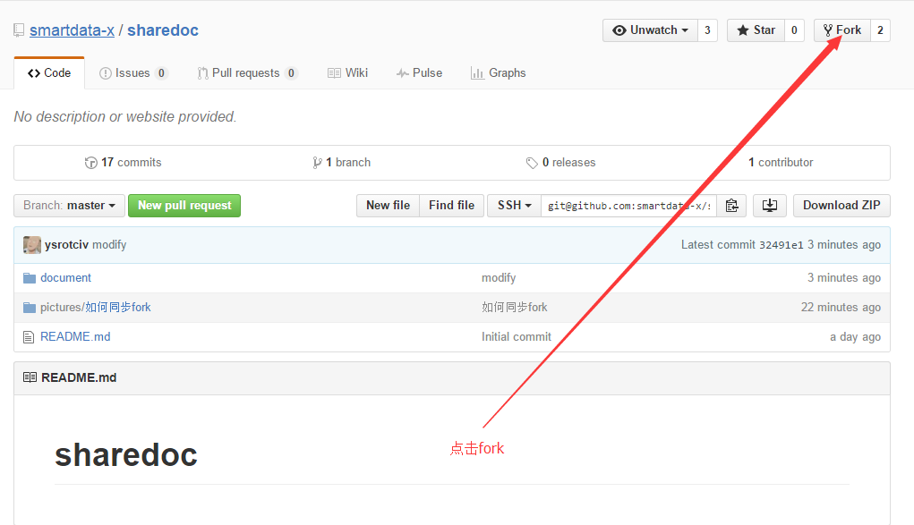
###2.选择fork到哪里
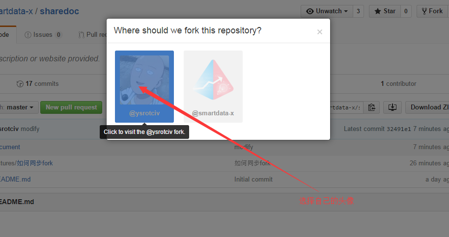
###3.从公司的repo切换到自己的repo
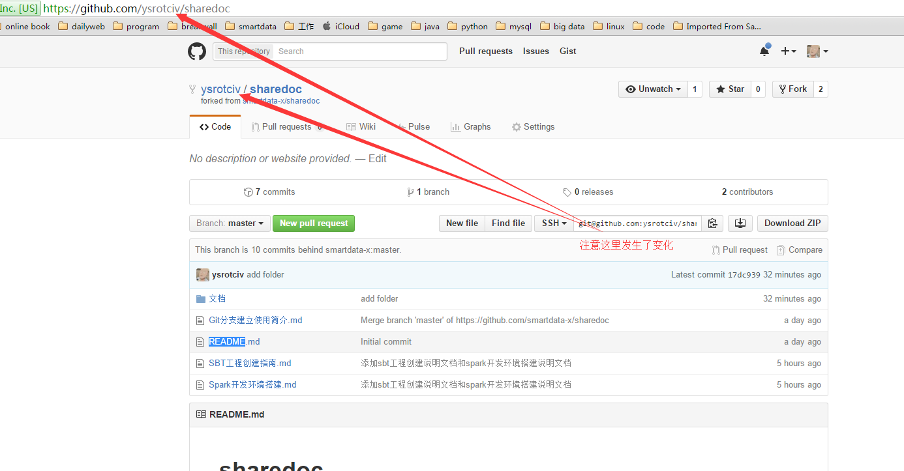
###4.复制repo地址
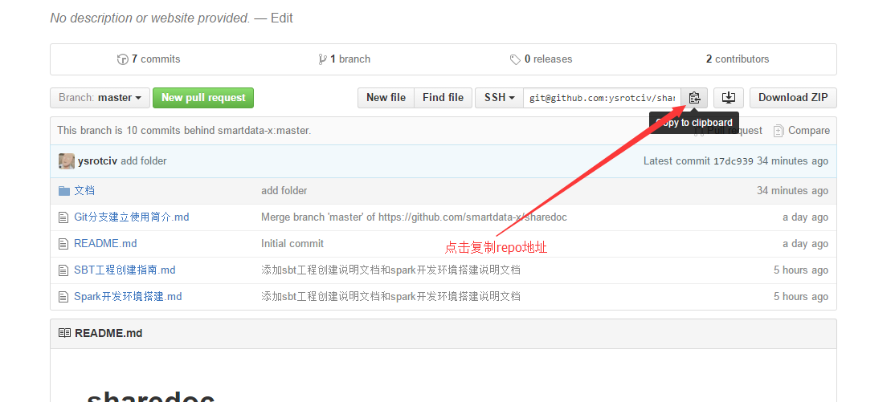
###5.clone到本地
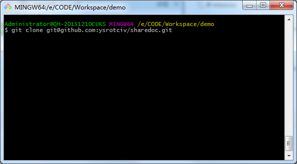
###6.修改文件(以README.md为例)
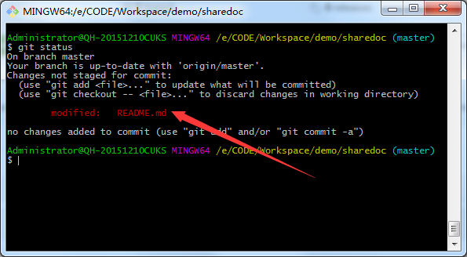
###7.暂存该文件的修改
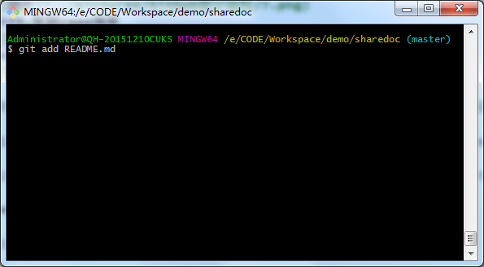
###8.将修改内容提交到本地仓库
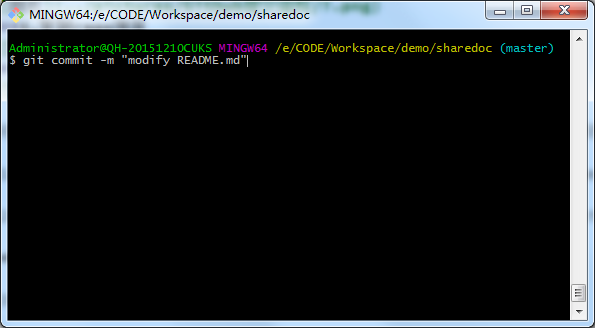
###9.将你仓库中的改动推送到你github的仓库
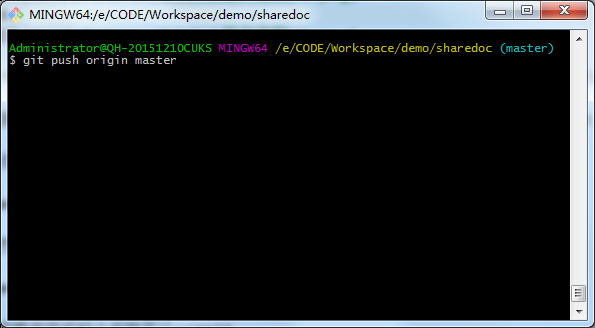
###10.检查推送是否成功
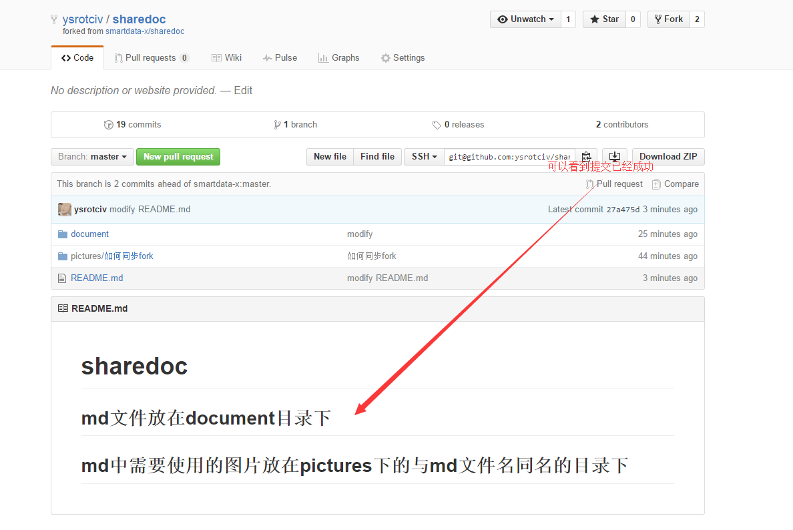
###11.如果提交内容较多,可以在commits页面检查提交是否成功
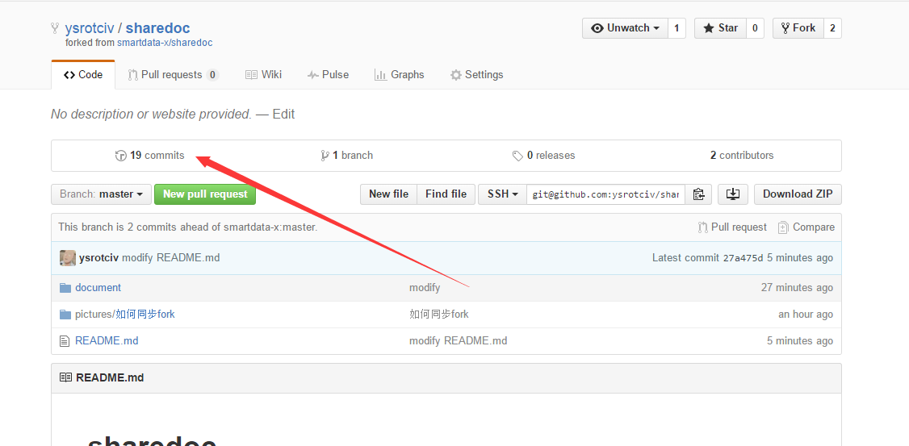
 
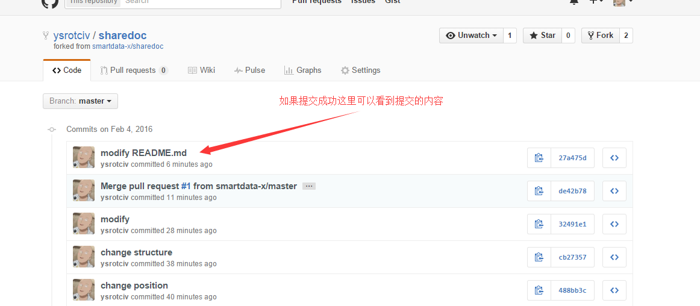
###12.点击该按钮发送pull request
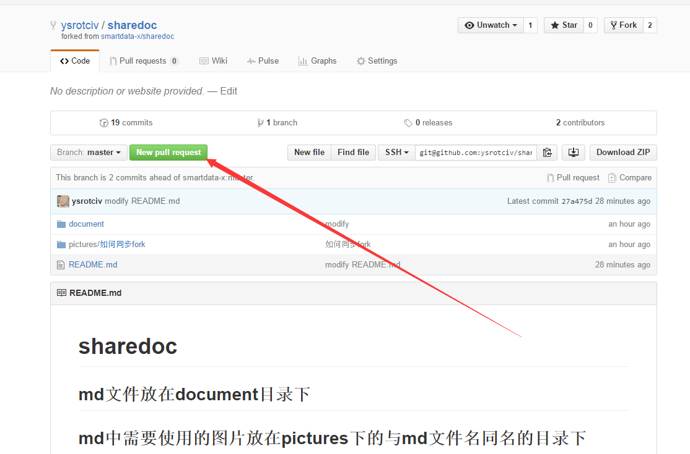
 
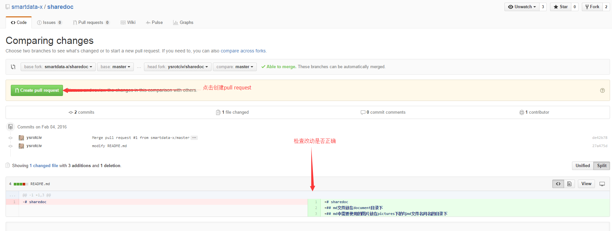
 
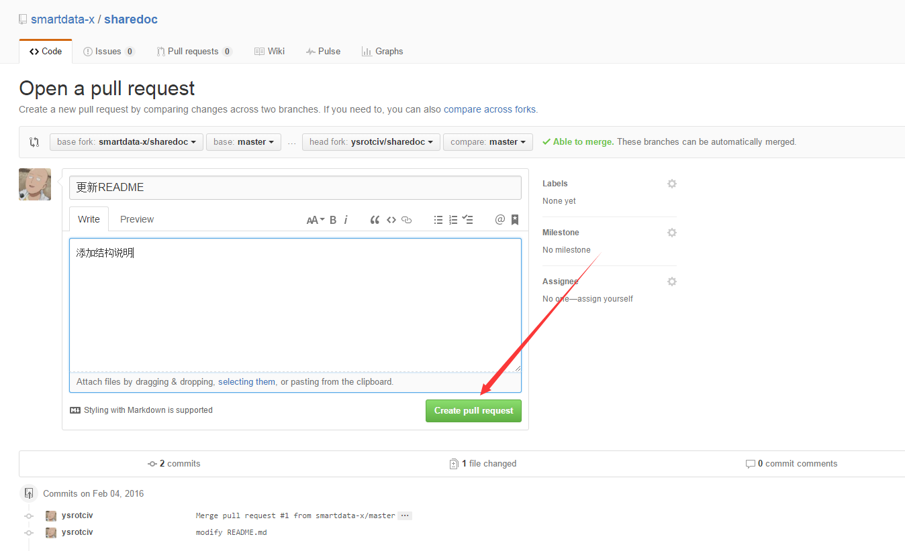
###13.结束
 
## 与原分支同步
###每次提交前需要让自己的仓库与公司的master进行同步
###具体步骤参照另一篇文章[如何同步fork](如何同步fork.md)
 
##[git学习资料一](http://www.google.com.hk)
##[git学习资料二](http://www.baidu.com)
