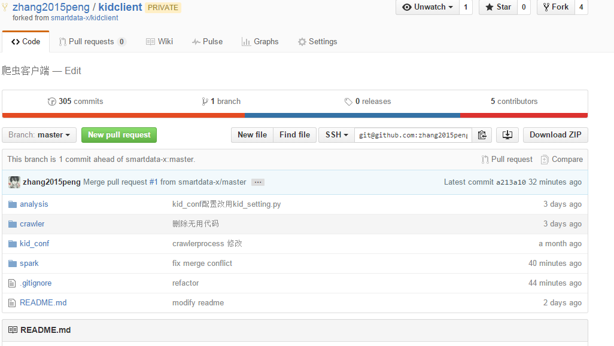
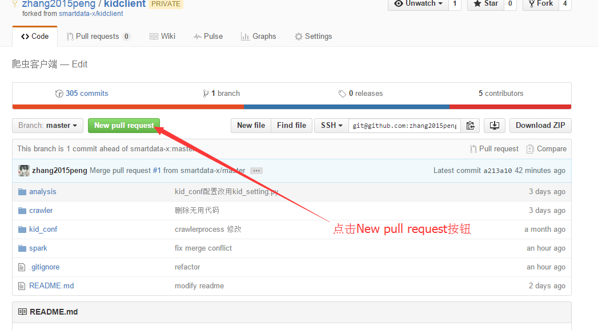
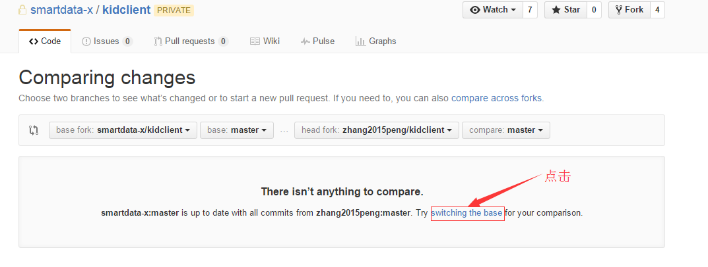
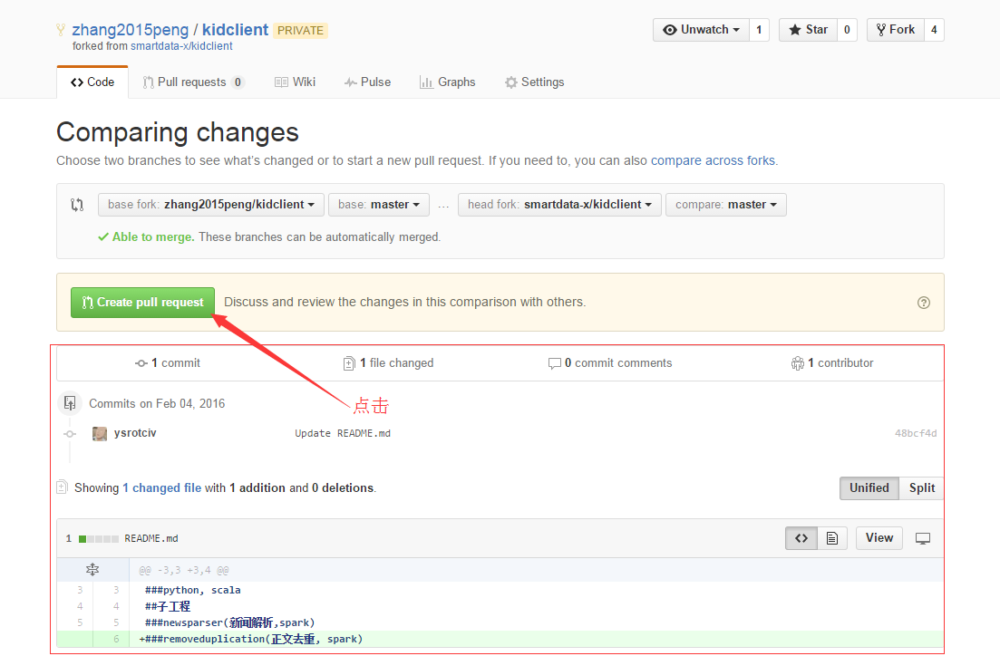
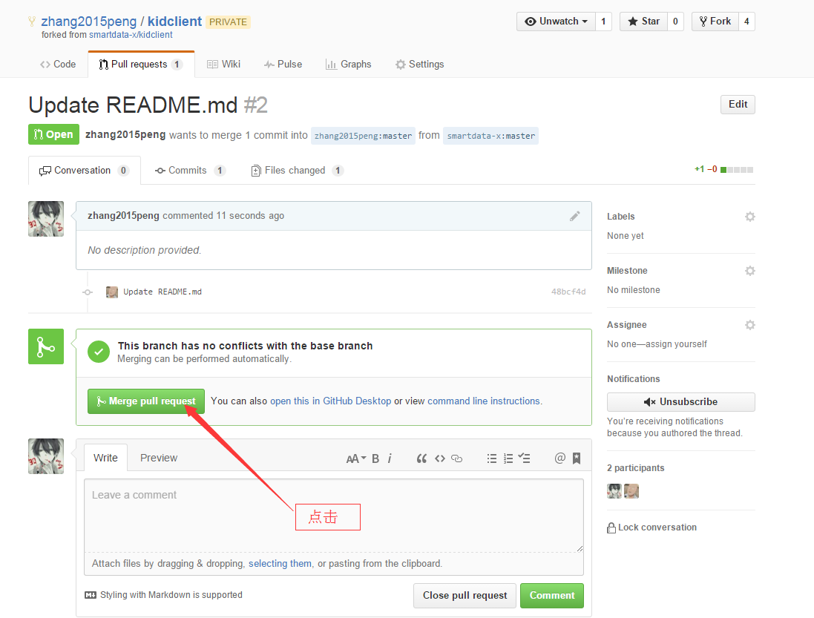
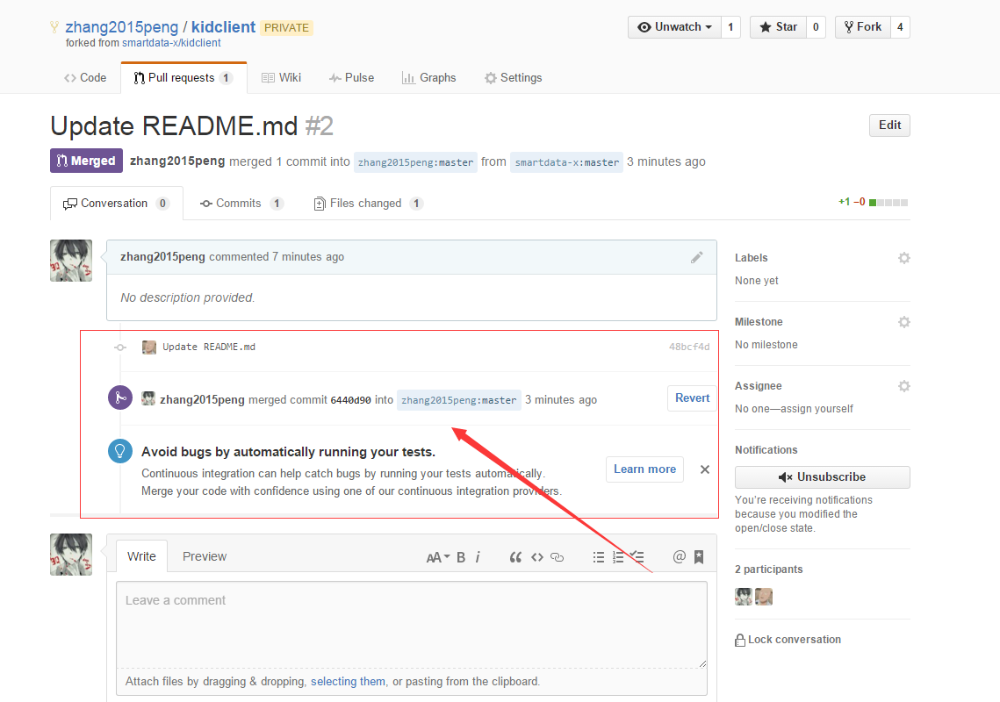

# 如何同步fork #
## 流程 ##

## 1.进入你自己fork的项目 ##

## 2.点击 New pull request 按钮 ##

## 3.点击下方 switching the base ##

## 4.如果主项目有其他人提交改动,会出现红框内的内容,点击Create new request ##

## 5.填写内容,点击 Create new request 按钮 ##

## 6.出现如下图界面,点击 Merge pull request 按钮 ##

## 6.如果成功,出现如下图红框内容 ##

## 参考网址 ##

##<https://www.zhihu.com/question/20393785/answer/30725725>##

